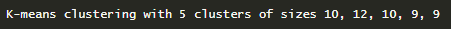
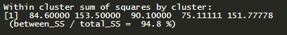

# Overview

This project is designed using a dataset of real case scenarios in Indonesia. For this project, the dataset used is quite small with the aim of being able to more easily understand this dataset and be able to adapt when faced with a more complex dataset, that will be downloaded from [here](https://academy.dqlab.id/dataset/customer_segments.txt).

What will be done in this project?

* What and why is Customer Segmentation in use on business?
* Technical Customer Segmentation Application with K-Means Algorithm in R
* How to prepare customer profile data in R so that it can be used by the K-Means algorithm
* Package algorithms as models and operationalize them so that they can be used daily by businesses

# Customer Segmentatiton

Customer segmentation is an important process needed in a business to get to know customers better. 

When you segment customers, you find characteristics that are similar in each customer's behavior and needs. Then generalized into groups to meet demands with various strategies. In addition, this strategy can be an input for:
1. Marketing activities targeted at specific groups
2. Launch of features in line with customer demand
3. Development of a product roadmap

With a sharper process, high potential business performance will be better too.

To find a good segmentation, it is necessary to process data analysis from customer profiles which is quite a lot and routine. This can be helped by computer algorithms.

# Dataset Preparation

## Load library
```{r warning=FALSE, message=FALSE}
library(dplyr)
library(ggplot2)
```


## Import Dataset
```{r warning=FALSE, message=FALSE}
# Reads csv data and inserts it into customer variables
customer <- read.csv("https://academy.dqlab.id/dataset/customer_segments.txt", sep="\t")

glimpse(customer)
```
The data has seven columns with the following explanation:

* Customer_ID: Customer code in mixed text format CUST- followed by numbers
* Nama.Pelanggan: Name of customer in text format of course
* Jenis.Kelamin: The gender of the customer, there are only two data content categories, namely `Pria` as Male and `Wanita` as Female
* Umur: The age of the customer in numeric format
* Profesi: The profession of customers, also with a text type category consisting of `Wiraswasta` as Entrepreneurs, `Pelajar` as Students, `Professional` as Professionals, `Ibu Rumah Tangga` as Housewives, and `Mahasiswa` as College Students.
* Tipe.Residen: The type of residence of our customers, for this dataset there are only two categories: `Cluster` and `Sector`
* NilaiBelanjaSetahun: is Yearly Shopping Value

We can see that there are columns that only contain numbers, namely `Umur` and `NilaiBelanjaSetahun`.
The rest is filled with category data for the `Jenis.Kelamin`, `Profesi` and `Tipe.Residen` columns.
Meanwhile, `Customer_ID` and `Nama.Pelanggan` are assumed to have unique values for each row of data and represent each individual.

Because the `Customer_ID` and `Nama.Pelanggan` columns are unique, they will not be used as segmentation determining variables, but the rest of the other columns will be used.

Now with this dataset, we will try to find the most optimal number of segmentations - where each customer data in a segment has a high similarity -.

## Data conversion with data.matrix

As previously explained, the data content of the three customer columns, namely `Umur`, `Profesi` and `Tipe.Residen` are categorical data in the form of text.

For the `k-means` function, these three columns cannot be used unless the contents are converted to numeric. One way is to use the data.matrix function.

```{r warning=FALSE, message=FALSE}
# Data conversion with data.matrix
customer_matrix <- data.matrix(customer[c("Jenis.Kelamin", "Profesi", "Tipe.Residen")])

# Merge the data back into our original variables
customer <- data.frame(customer, customer_matrix)

head(customer)
```

Now we get a new column named `Jenis.Kelamin.1`, `Profesi.1`, and `Tipe.Residen.1`.

## Normalize Shopping Value

```{r}
# Normalize Shopping Value
customer$NilaiBelanjaSetahun <- customer$NilaiBelanjaSetahun/1000000
```

## Create Master Data

```{r}
# Fill in master data
Profesi <- unique(customer[c("Profesi", "Profesi.1")])
Jenis.Kelamin <- unique(customer[c("Jenis.Kelamin","Jenis.Kelamin.1")])
Tipe.Residen <- unique(customer[c("Tipe.Residen","Tipe.Residen.1")])

# Create a variable field that is used
field_used = c("Jenis.Kelamin.1","Umur","Profesi.1", "Tipe.Residen.1", "NilaiBelanjaSetahun")
```

# Clustering and K-Means Algorithms

Clustering is the process of dividing objects into several groups (clusters) based on the level of similarity between one object and another.

K-means is an algorithm that divides data into a number of partitions in a simple way: finding the closeness of each point on a cluster to a number of mean or average values.

There are two key concepts that k-means has also come from:
• The number of partitions desired, represented by the letter k
• Finding the "distance" of the proximity of each point to the average number of cluster values observed, represented by means

```{r}
# K-Means section
set.seed (100)
# function kmeans to form 5 clusters with 25 random scenarios and save them into segmentation variables
segmentation <- kmeans(x=customer[field_used], centers=5, nstart=25)
# Show k-means results
segmentation
```
## Analysis of Vector Clustering Results

```{r}
customer$cluster
```
This clustering vector is a series of vectors that contains cluster numbers. From our results, the vector contains the numbers 1 to 5, the maximum according to the number of clusters we want.
This vector starts from number 5, which means that the first data from our dataset will be allocated to cluster number 5. From the result it is also seen that the contents of the second vector are 1, this means that the second data from our dataset is allocated to cluster number 1, and so on. The last data position (50th) has cluster number 5.

```{r}
# add this segmentation result to the original data
customer$cluster <- segmentation$cluster

# Displays the structure of customer data
str(customer)

```
## Analysis of Cluster Size Results

```{r}
segmentation$size
```
This means that with k-means we have divided the customer dataset by 5 clusters, where:

* The 1st cluster has 10 data
* The 2nd cluster has 12 data
* The 3rd cluster has 10 data
* The 4th cluster has 9 data
* The 5th cluster has 9 data

```{r}
# 1st cluster filter
which(customer$cluster == 1)
```
The results above show **10** numbers for the data position for cluster **1**. The number of numbers in this series corresponds to the size for the 1st cluster of the information above.

```{r}
# to ascertain whether the number of rows is the same
length(which(customer$cluster == 1))
```
```{r}
# 2nd cluster filter
which(customer$cluster == 2)
length(which(customer$cluster == 2))
# 3rd cluster filter
which(customer$cluster == 3)
length(which(customer$cluster == 3))
# 4th cluster filter
which(customer$cluster == 4)
length(which(customer$cluster == 4))
# 5th cluster filter
which(customer$cluster == 5)
length(which(customer$cluster == 5))
```
## View data clusters

```{r}
# View data clusters 1
customer[which(customer$cluster == 1),] 
```
```{r}
# View data clusters 2
customer[which(customer$cluster == 2),]
```
```{r}
# View data clusters 3
customer[which(customer$cluster == 3),]
```
```{r}
# View data clusters 4
customer[which(customer$cluster == 4),]
```
```{r}
# View data clusters 5
customer[which(customer$cluster == 5),]
```

## Analysis of Cluster Means Results

Cluster means are the average value or central point (centroid) of all points for each cluster.

```{r}
segmentation$centers
```
What do these results mean?

* The first column containing numbers 1 to 5 represents the cluster number.
* Gender (`Jenis.Kelamin.1`) Column.1 shows the average value of the gender data which has been converted to numeric, with 1 representing Male (`Pria`) and 2 representing Female (`Wanita`).

In cluster 1, it can be seen that there is only number `2`, meaning that cluster 1 only contains data with a female (`Wanita`) gender profile. Now, for the second cluster the number is `1.75`, meaning that the data is mixed but tends to be female (2).

Both interpretations of these figures are consistent with the results of the "Viewing Data Clusters"

* The Age column is a representation of the original dataset without undergoing conversion. It can be seen that for cluster 1 the average age is 18 years, age 35 years for the second cluster, and so on.
* Column 1 shows the average value of the Professional data for each cluster which has been converted to numeric.

Figures 1, 2, 3, 4 and 5 represent Housewives, College Students, Students, Professionals, and Entrepreneurs.

Seen for the whole cluster, professions tend to be Professional especially for the 4th cluster.

* Column `Tipe.Residen.1` shows the representation of the Resident Type data which has been converted to numeric with the numbers 1 representing the Cluster and 2 representing the Sector. This is also obtained from the conversion of data to numeric in the previous results.

It can be seen that for all clusters, it can be seen that the data is quite scattered between the Sector and Cluster, especially for the 3rd cluster where the value of this column is 1.600.

* Finally, the distribution of the value for the year-to-year (`NilaiBelanjaSetahun`) column is significant for each cluster. Where the 4th and 5th clusters have higher spending value than the other three clusters.

This is perhaps the target customer who can be more targeted through a marketing campaign, because the 4th and 5th clusters currently only contain 9 data. The proportions are very evenly distributed in each cluster, and want to be increased.

This can be seen from the results of the first section of the kmeans output which shows the distribution of the amount of data from each cluster:

{width=50%}

## Analysis of Sum of Squares Results

{width=50%} \n

\n The concept of sum of squares (SS) is the sum of the "squares distance" that each data point differs from its mean or centroid. This SS can be the mean or centroid for each cluster or the entire data set. Sum of squares in other data science literature is often called Sum of Squared Errors (SSE).

The greater the SS value, the greater the difference between each data point in the cluster.

Based on this concept, the following is an explanation for the output kmeans above:

1. The value 84.60000 is SS for the 1st cluster, 153.50000 is the SS for the 2nd cluster, and so on. The smaller the value, the better the potential.
2. total_SS: is the SS for all points against the global mean value, not for per cluster. This value is always fixed and is not affected by the number of clusters.
3. between_SS: is the total_SS minus the number of SS values for the entire cluster.
4. (between_SS / total_SS) is the ratio between between_SS divided by total_SS. The bigger the percentage, generally the better.

# Determining the Best Number of Clusters

From the information generated by the kmeans function, the Sum of Squares (SS) metrick or often called the Sum of Squared Errors (SSE) is very important to be used as a basis for us to determine the most optimal number of clusters.

Theoretically, here are some of the things we can observe with SS:
* The smaller the number of clusters produced, the greater the SS value.
* Vice versa, the more clusters are generated, the smaller the SS value.
* Because it is quadratic, if there is a significant difference between each cluster combination, the difference in SS values will be even greater.
* And as the number of clusters increases, the differences for each SS will get smaller.

The first step in this clustering is to find the right number of cluster. This process can be done by make a elbow curve and choose the most optimized cluster based on that curve. Elbow curve is a curve that made by plotting Sum Square Error (SSE) from the K-Means alghoritm. This number represent the sum square value of the actual point distance to the central of each cluster.

## Elbow CUrve

```{r}
# Function to call the kmeans function for a range of number of clusters
sse <- sapply(1:10,
              function(param_k)
                {
                kmeans(customer[field_used], param_k, nstart=25)$tot.withinss
                }
              )
# Plot
total_cluster_max <- 10
ssdata = data.frame(cluster=c(1:total_cluster_max),sse)
ggplot(ssdata, aes(x=cluster,y=sse)) +
  geom_line(color="red") +
  geom_point() +
  ylab("Within Cluster Sum of Squares") + 
  xlab("Number of Cluster") +
  geom_text(aes(label=format(round(sse, 2), nsmall = 2)),hjust=-0.2, vjust=-0.5) +
  scale_x_discrete(limits=c(1:total_cluster_max))


```

It can be seen that the optimal number of clusters we can use is 5, and this is our decision as the number of customer segmentations.

# K-Means Model

After successfully preparing the data, using the kmeans algorithm, and finally being able to decide on the best number of clusters.

So the next step is to "package" or "wrap" all the converted references and these kmeans objects so they can be used to process new and useful data in business.

For this the stages are as follows:
* Naming clusters with characteristics that are easier to understand. We store this naming in the Segment.Customer variable.
* Combining segment variables. Customer, Profession, Gender, Type.Resident, and Segmentation into one object of type list into variable Identity Cluster.
* Storing the Identity Cluster object in a file so that it can be used later, this can be called a model for us

## Naming Segments

Let's try to name the clusters 1 to 5 as follows:

* Cluster 1: Silver Youth Gals: the reason is because the average age is 18, all women, the profession is mixed between students, college students, Entrepreneur and professionals and the expenditure is around 5 million.
* Cluster 2: Diamond Professional: the reason is because average age is 35 years, professionals.
* Cluster 3: Silver Mid Professional: the reason is because the average age is 48 years and spend around 6.9 million.
* Cluster 4: Gold Young Professional: the reason is because the average age is 27 years, professional and the spending is quite large.
* Cluster 5: Diamond Senior Member: the reason is because average age is 58 years and spend over 7.8 million.

```{r}
# Naming Segments
Customer.Segment <- data.frame(cluster=c(1,2,3,4,5), Segmen.Name=c("Silver Youth Gals", "Diamond Professional", "Silver Mid Professional", "Gold Young Professional", "Diamond Senior Member"))

# Combining all assets into the Identity cluster variable
identity_cluster <- list(Profesi=Profesi, Jenis.Kelamin=Jenis.Kelamin, Tipe.Residen=Tipe.Residen, segmentation=segmentation, Customer.Segment=Customer.Segment, field_used=field_used)

# Saving Objects in File Form
saveRDS(identity_cluster,"cluster.rds")
```

# Operate the K-Means Model

Operationalize the model that has been made with the K-means algorithm so that it can be used daily by business people. The object of the processing of the K-Means algorithm and the related variables that we produce must be able to be used to the real case so that a complete cycle occurs.

The real case for our clustering is quite simple: how new data can automate help marketing and CRM teams to quickly identify which segment these customers belong to.

With the speed of identification, the organization or business can quickly move with an effective marketing message and win the competition.

## New Data

```{r}
# Create new data
newdata <- data.frame(Customer_ID="CUST-100", Nama.Pelanggan="Rudi Wilamar",Umur=20,Jenis.Kelamin="Wanita",Profesi="Pelajar",Tipe.Residen="Cluster",NilaiBelanjaSetahun=3.5)

newdata
```
# Loading Clustering Objects from File

```{r}
# Load Object
readRDS(file="cluster.rds")

# Save it as a variable with the name identity_cluster
saveRDS(identity_cluster,"cluster.rds")
identity_cluster
```
## Merge with Reference Data

```{r}
# merging of data

newdata <- merge(newdata, identity_cluster$Profesi)
newdata <- merge(newdata, identity_cluster$Jenis.Kelamin)
newdata <- merge(newdata, identity_cluster$Tipe.Residen)
newdata

```
## Defining Clusters

```{r}
# determine which cluster new data is
which.min(sapply(1:5,
                 function(x)sum(
                   (newdata
                    [identity_cluster$field_used] -
                      identity_cluster$segmentation$centers[x,])^2)
                 )
          )

# specify which cluster new data is in by making the which.min (…) command the index on the cluster name reference
identity_cluster$Customer.Segment[which.min(
  sapply(1:5,
         function(x)sum(
           (newdata[identity_cluster$field_used] - identity_cluster$segmentation$centers[x,])^2 ))),]

```


