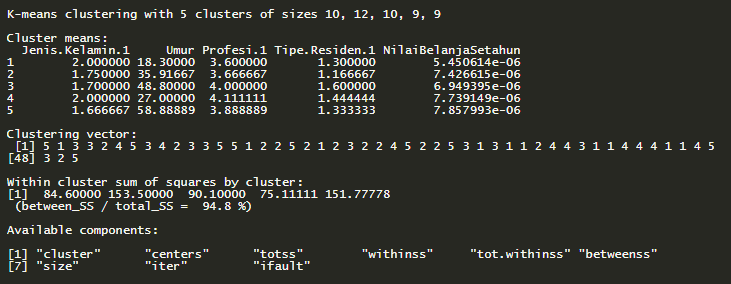

# Customer Segmentation Using K-Means Algorithm

This project is designed using a dataset of real case scenarios in Indonesia. For this project, the dataset used is quite small with the aim of being able to more easily understand this dataset and be able to adapt when faced with a more complex dataset, that will be downloaded from [here](https://academy.dqlab.id/dataset/customer_segments.txt).

What will be done in this project?

* What and why is Customer Segmentation in use on business?
* Technical Customer Segmentation Application with K-Means Algorithm in R
* How to prepare customer profile data in R so that it can be used by the K-Means algorithm
* Package algorithms as models and operationalize them so that they can be used daily by businesses

# Customer Segmentatiton

Customer segmentation is an important process needed in a business to get to know customers better. 

When you segment customers, you find characteristics that are similar in each customer's behavior and needs. Then generalized into groups to meet demands with various strategies. In addition, this strategy can be an input for:
1. Marketing activities targeted at specific groups
2. Launch of features in line with customer demand
3. Development of a product roadmap

With a sharper process, high potential business performance will be better too.

To find a good segmentation, it is necessary to process data analysis from customer profiles which is quite a lot and routine. This can be helped by computer algorithms.

